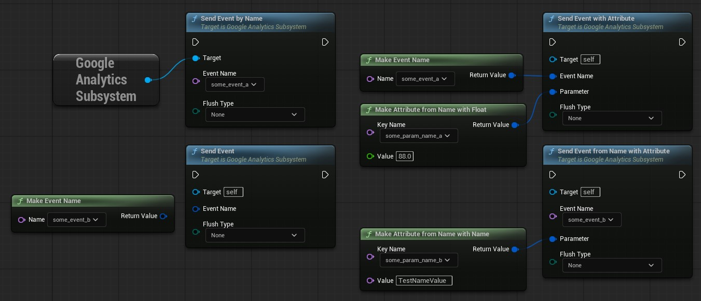
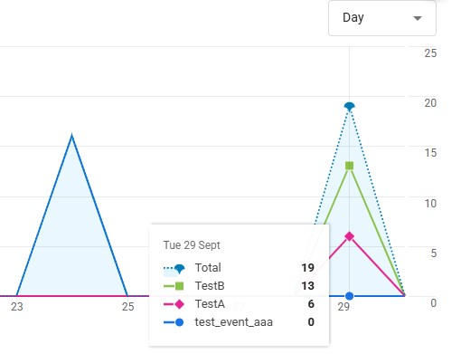
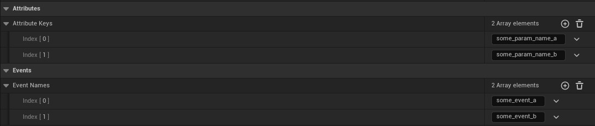

# Presentation
An UE5 plugin capable of sending events to Google Analytics through HTTP requests.

There is 2 core classes to use to make and send events: `Google Analytics Subsystem` and `Google Analytics Library`.

There is XXXX struct types: 
- The actual event `FUGAEvent` (C++ only)
- `Google Analytics Event Name`
- `Google Analytics Attribute`
- `Google Analytics Attribute Key`
- `Google Analytics Attribute Value` (Can be a bool, int32, float, String or a Name for now).

Examples of a few nodes.

Example of the events being showed on the dashboard:

**WARNING**  
Since the data is sent through HTTP requests any malicious user could get your secret token and send fake events.

There are many solutions to safely send data to Google Analytics, here is a list of independant solutions:
1. If you have a multiplayer project with a dedicated server, send the data from the server only.
2. Send the dat to a intermediate URL, and perform some sanity checks. You can also use cooldowns or some "anti cheat" algorithms to detect potential malicous data.

# Setup
0. You must have an Account and Property already set up in your Analytics dashboard. The `Stream Type` should be `Web` (the website URL can be anything, even if it doesn't exist).
1. Clone the plugin in your `MyProject/Plugins` folder (create the folder if it doesn't exist).
2. Launch your project and enable the plugin in the `Plugins` window.
3. Restart the project.
4. In the `Project Settings`, scroll down to the `Plugins` section, and click on `Unreal Google Analytics`.
5. The only two required settings to fill are `Measurement ID` and `Secret`. You can find those in your Analytics dashboard in the `Admin` panel at `Data collection and modification -> Data streams`. (The secret has to be generated by you in the `Measurement Protocol API secrets
` section).
6. You can now send events with or without parameters (Called `Attributes` in this plugin).
7. Add all your event names and attribute keys in the `Project Settings` to use the dropdown feature.
